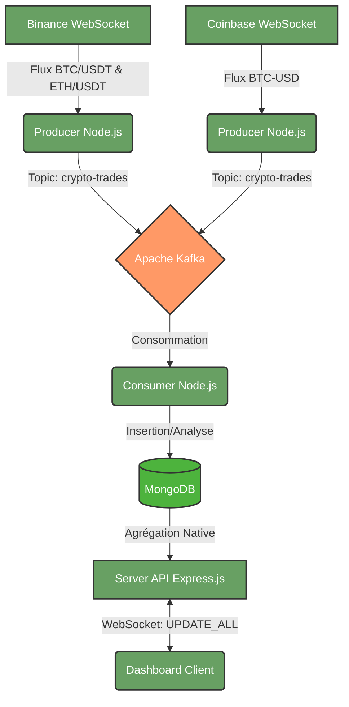

# 📘 CryptoMonitor (Real-Time Pipeline)

Ce dépôt contient l'intégralité du code source d'un système de monitoring de marché crypto en temps réel. Le projet repose sur une architecture Big Data robuste, conçue pour ingérer, traiter et afficher des flux financiers à haute fréquence.

## 1. Architecture du Système



### La Stack Technique Utilisée
* **Ingestion** : Node.js (ws)
* **Message Broker** : Apache Kafka (Zookeeper)
* **Base de données** : MongoDB (NoSQL orienté document)
* **Backend** : Express.js, WebSocket (`ws`), Pilote natif MongoDB
* **Frontend** : Vanilla HTML/CSS/JS, CSS Variables (Dark Mode dynamique), Chart.js pour la visualisation.

---

## 2. Les Pipelines d'Agrégation (MongoDB)

L'une des forces du projet réside dans le déportement des calculs lourds directement sur le moteur de base de données (MongoDB Aggregation Framework).

### A. Pipeline : Prix Moyen Mobile (Graphique Principal)
Ce pipeline récupère les trades des 30 dernières minutes, les regroupe minute par minute, et calcule le prix moyen, le volume et le nombre de trades.

### B. Pipeline : VWAP & Statistiques (Cartes KPI)
Calcul du *Volume-Weighted Average Price* par fenêtres spécifiques (ex: 1m, 5m, 15m), directement pré-calculé par les Consumers et lu par le Dashboard.

### C. Pipeline : Statistiques d'Alertes
Groupe les anomalies détectées par le Consumer (ex: Pic de volume soudain) pour afficher le niveau de risque sur le Dashboard.

---

## 3. Le Dashboard

L'interface a été conçue pour être "Premium" et temps réel :
* **Multi-Cryptos Dynamique** : Une barre de navigation pour switcher instantanément entre `BTC/USDT`, `BTC-USD` et `ETH/USDT`.
* **Thématisation par Actif** : Le design change de couleur selon l'actif sélectionné.
* **Temps Réel Fluide** : Un rafraîchissement continu toutes les 5 secondes poussé par WebSocket.
* **Épuration de l'UI** : UI minimaliste pour concentrer l'attention sur la donnée pure.

---

## 4. Guide d'Exécution du Projet (Ancien mode d'emploi)

### 1. Prérequis
Assurez-vous d'avoir installé localement :
* [Node.js](https://nodejs.org/) (v16 ou supérieur)
* [Docker Desktop](https://www.docker.com/products/docker-desktop/)

### 2. Démarrage de l'Infrastructure (Docker)
Démarrez les services Kafka, Zookeeper, Confluent Control Center et MongoDB en arrière-plan :
```bash
docker compose up -d
```

### 3. Initialisation du Topic Kafka
Exécutez cette commande pour créer le topic avec ses 3 partitions et sa rétention de 24 heures :
```bash
docker exec broker kafka-topics --bootstrap-server broker:29092 --create --if-not-exists --topic crypto.trades.raw --partitions 3 --replication-factor 1 --config retention.ms=86400000
```

### 4. Installation des Dépendances Node.js
```bash
npm install
```

### 5. Lancement de l'Application
Lancez les producteurs et les consommateurs simultanément :
```bash
npm start
```

* **Pour exécuter uniquement les flux WebSockets (Ingestion)** : `npm run producers`
* **Pour exécuter uniquement le traitement (Consommateurs)** : `npm run consumers`

---

## 🔗 Liens Associés & Outils

* 📊 **Confluent Control Center** : [http://localhost:9021](http://localhost:9021)
  * *Permet de surveiller la santé des brokers, inspecter le topic `crypto.trades.raw` et suivre le lag de consommation des consumer groups en temps réel.*
* 🗄️ **MongoDB Connection URI** : `mongodb://localhost:27017/crypto_monitor`
  * *Utilisable avec [MongoDB Compass](https://www.mongodb.com/products/tools/compass) pour observer les collections `trades`, `aggregates` et `alerts` se mettre à jour en direct.*
* 🔌 **WebSocket Binance** : `wss://stream.binance.com:9443`
* 🔌 **WebSocket Coinbase** : `wss://advanced-trade-ws.coinbase.com`
