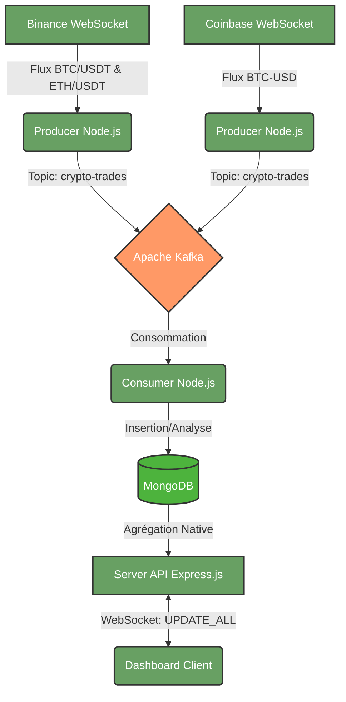

# 📘 CryptoMonitor (Real-Time Pipeline)

Ce dépôt contient l'intégralité du code source d'un système de monitoring de marché crypto en temps réel. Le projet repose sur une architecture Big Data robuste, conçue pour ingérer, traiter et afficher des flux financiers à haute fréquence.

## 1. Architecture du Système



### La Stack Technique Utilisée
* **Ingestion** : Node.js (ws)
* **Message Broker** : Apache Kafka (Zookeeper)
* **Base de données** : MongoDB (NoSQL orienté document)
* **Backend** : Express.js, WebSocket (`ws`), Pilote natif MongoDB
* **Frontend** : Vanilla HTML/CSS/JS, CSS Variables (Dark Mode dynamique), Chart.js pour la visualisation.

---

## 2. Les Pipelines d'Agrégation (MongoDB)

L'une des forces du projet réside dans le déportement des calculs lourds directement sur le moteur de base de données (MongoDB Aggregation Framework).

### A. Pipeline : Prix Moyen Mobile (Graphique Principal)
Ce pipeline récupère les trades des 30 dernières minutes, les regroupe minute par minute, et calcule le prix moyen, le volume et le nombre de trades.

### B. Pipeline : VWAP & Statistiques (Cartes KPI)
Calcul du *Volume-Weighted Average Price* par fenêtres spécifiques (ex: 1m, 5m, 15m), directement pré-calculé par les Consumers et lu par le Dashboard.

### C. Pipeline : Statistiques d'Alertes
Groupe les anomalies détectées par le Consumer (ex: Pic de volume soudain) pour afficher le niveau de risque sur le Dashboard.

---

## 3. Le Dashboard

L'interface a été conçue pour être "Premium" et temps réel :
* **Multi-Cryptos Dynamique** : Une barre de navigation pour switcher instantanément entre `BTC/USDT`, `BTC-USD` et `ETH/USDT`.
* **Thématisation par Actif** : Le design change de couleur selon l'actif sélectionné.
* **Temps Réel Fluide** : Un rafraîchissement continu toutes les 5 secondes poussé par WebSocket.
* **Épuration de l'UI** : UI minimaliste pour concentrer l'attention sur la donnée pure.

---

## 4. Manuel d'Exécution du Projet

Assurez-vous d'avoir démarré l'environnement Kafka et MongoDB sur votre machine locale avant de lancer l'application Node.js.

### Étape 1 : Démarrer l'infrastructure
1. Lancer **MongoDB** (sur le port 27017 par défaut).
2. Lancer **Zookeeper** (port 2181) puis **Kafka** (port 9092).

### Étape 2 : Lancer l'Ingestion (Producteurs & Consommateurs)
Ouvrez plusieurs terminaux distincts :
```bash
# Terminal 1 - Producteur Binance
node producers/binance-producer.js

# Terminal 2 - Producteur Coinbase
node producers/coinbase-producer.js

# Terminal 3 - Consommateur (Traite Kafka -> MongoDB)
node consumers/trade-consumer.js
```

### Étape 3 : Démarrer l'API & le Dashboard
Ouvrez un dernier terminal pour le serveur Web :
```bash
npm run server
```

### Étape 4 : Visualiser
* Ouvrez votre navigateur sur [http://localhost:3000](http://localhost:3000).
* Naviguez entre les onglets pour explorer les différentes paires d'actifs.
* Laissez tourner les producteurs pour observer le graphique avancer en temps réel.
